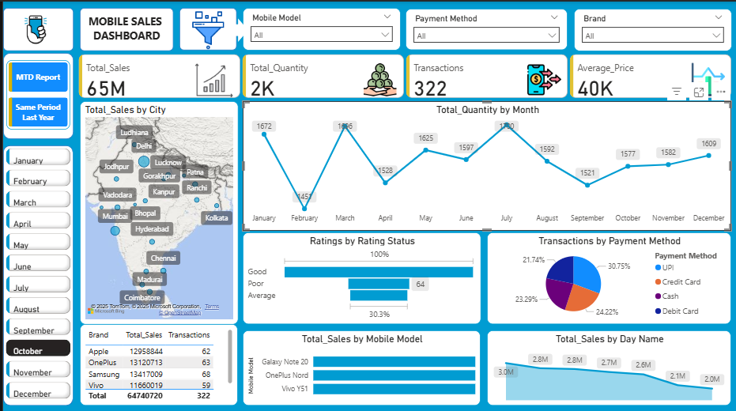

# Mobile Sales Dashboard
Interactive Power BI dashboard to visualize mobile phone sales performance by city, model, and payment method. Built using DAX, Power Query, and real-world sales KPIs.

#  Dashboard Preview

# Project Highlights

•	Built a comprehensive Power BI dashboard to visualize mobile sales performance across cities, brands, and models.
•	Displayed key KPIs such as Total Sales (₹65M), Quantity Sold (2K), and Average Price (₹40K).
•	Used DAX to create dynamic measures and Power Query for data cleaning and shaping.
•	Analyzed sales trends by region, month, and day to identify peak performance periods.
•	Visualized transactions by payment method (UPI, Credit Card, Cash, etc.) with interactive visuals.
•	Enabled user-driven filtering with slicers for product, location, time, and payment type.
•	Delivered actionable insights for business teams to support data-driven decision-making

# Key Insights & Features
•	Developed an interactive Power BI dashboard to analyze mobile phone sales data.
•	Uncovered regional sales trends and identified top-performing markets and products.
•	Built custom KPIs using DAX, including Total Revenue, Units Sold, and Profit Margin.
•	Tracked monthly sales performance to highlight seasonal trends and growth opportunities.
•	Cleaned and transformed raw sales data using Power Query for accurate, consistent reporting.
•	Integrated dynamic filters for product category, region, and time to support ad hoc analysis.
•	Set up automated data refresh for real-time insights without manual updates.
•	Empowered business teams to make quick, data-informed decisions based on clear visuals.

# Why This Project Stands Out

•	End-to-End Solution: Covers the full data pipeline — from cleaning raw sales data to building a professional, interactive dashboard.
•	Business-Driven Insights: Designed to support real-world decision-making with clear KPIs, regional breakdowns, and product-level analysis.
•	Smart Use of Power BI: Demonstrates strong command of Power Query and DAX to build custom measures and automate updates.
•	User-Focused Design: Includes dynamic filters, intuitive visuals, and drill-through options for deeper exploration.
•	Practical Value: Solves a common business need — understanding sales trends and identifying growth opportunities.

# Tools Used
•	Microsoft Power BI  
•	Power Query  
•	DAX (Data Analysis Expressions)  
•	Excel (as data source)

#  Files Included
•	`Mobile_Sales_Dashboard.pbit` –
•	`Dashboard.png` – 

#  How to Use
1. Clone or download this repository.
2. Open the `.pbit` file in Power BI Desktop.
3. Load the data (or connect your own source if needed).
4. Use the filters and visuals to explore mobile sales trends.

## 📁 Files Included

- `Mobile_Sales_Dashboard.pbit` – Power BI Template File  
  (–https://github.com/anuradhamzn26/Powerbi-Mobile-Sales-Dashboard/blob/main/Dashboard.png?raw=true)

---

#  Feedback
Thank you for checking out this project!  
If you found it useful or have suggestions:

•	Star this repository to support the project  
•	Open an issue if you notice any improvements or bugs  
•	Feel free to fork and use it in your own way  
•	Connect with me on [LinkedIn]) to share your feedback or ask questions

